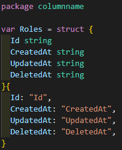

Generate the column name code to use without hard code column name

## How to generate code
```
import "github.com/skyrocketOoO/gormx/columnname"
columnname.GenTableColumnNamesCode(db, tableNames, path)
```

## How to use

```
var db *gorm.DB
db.Where(? = ?, column.Roles.ID, 1)
```
