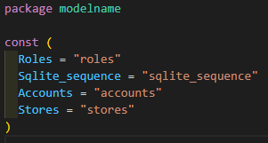

Generate the column name code to use without hard code column name

## How to generate code
```
import "github.com/skyrocketOoO/gormx/tablename"
columnname.GenTableNamesCode(db, path)
```

## How to use

```
var db *gorm.DB
db.Model(table.Roles)
```
